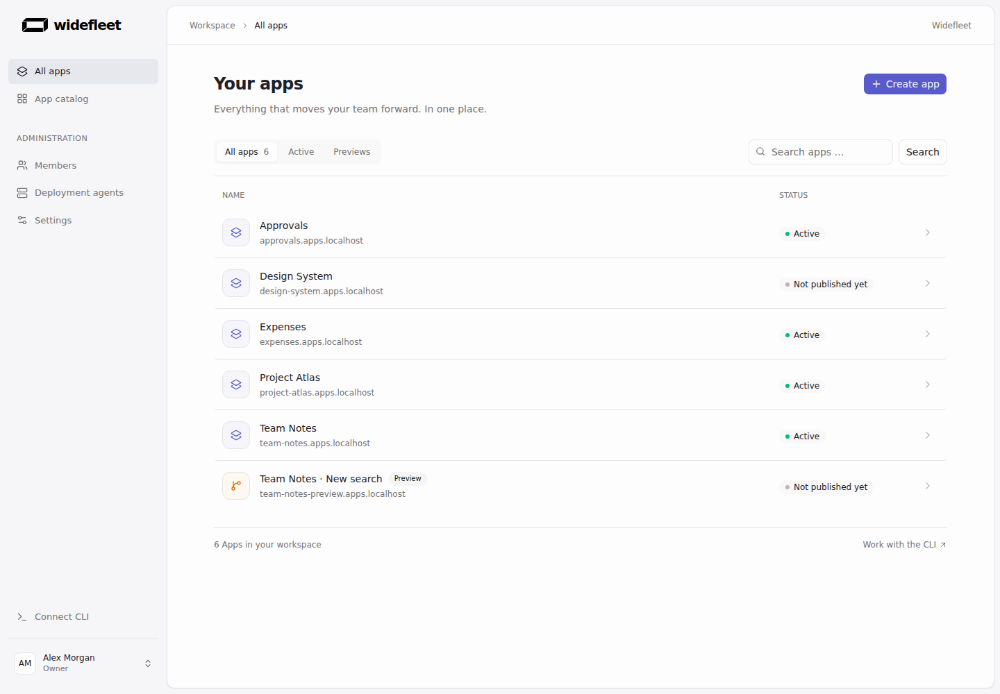
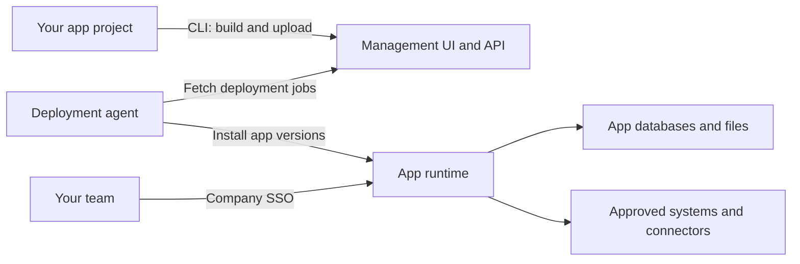

<picture>
  <source media="(prefers-color-scheme: dark)" srcset="apps/docs/public/favicon-dark.svg">
  
</picture>

# Widefleet

**Open-source, self-hosted platform for agent-built apps and workflows.**

Build internal tools with your coding agent and keep the app code in your own project. Widefleet gives your team a shared place to deploy and use them, with company login, databases, file storage and controlled access to your systems.

[Try it locally](#try-it-locally) · [Deploy your first app](#deploy-your-first-app) · [Self-host](https://widefleet.com/docs/self-hosting/installation) · [Documentation](https://widefleet.com/docs)

<picture>
  <source media="(prefers-color-scheme: dark)" srcset="docs/assets/control-plane/apps-dark.png">
  
</picture>

_The management workspace with synthetic example apps._

## What you can do

- **Build with your own tools.** Start with an independent SvelteKit project, edit it with your coding agent and deploy through the [CLI](https://widefleet.com/docs/getting-started/installation).
- **Give colleagues access.** Use company SSO, manage [app access groups](https://widefleet.com/docs/reference/app-access) and make apps discoverable in the shared catalog.
- **Keep app data together.** Declare databases, file storage and key-value bindings. Data survives code deployments; previews have their own resources. [Runtime and storage](https://widefleet.com/docs/reference/runtime).
- **Control system access.** Grant specific external destinations through [network permissions](https://widefleet.com/docs/guides/network) and expose IT-managed services through [connectors](https://widefleet.com/docs/guides/connectors).
- **Run background work.** Use Cron, Queues and durable [Workflows](https://widefleet.com/docs/guides/workflows), including retries and waits for events.
- **Operate your apps.** Publish [previews](https://widefleet.com/docs/reference/previews), inspect deployment history, roll back code and query [app logs](https://widefleet.com/docs/self-hosting/runtime-logs) from the CLI.

## Try it locally

Use **Linux x86-64**, **Docker Engine 29.8.1**, Docker Compose **2.20.0 or newer**, Bash, Git and an internet connection. Rootless Docker is supported. Keep ports `25450`, `25452` and `25453` available. No local Node.js, pnpm, Rust, company identity provider or DNS setup is needed.

```sh
git clone https://github.com/widefleet/widefleet.git
cd widefleet
./dev up
```

1. Open **http://localhost:25450**, choose **Sign in with Microsoft** and select **admin@example.test** in the local identity provider.
2. Open **Team Notes** from management and sign in with the same account.
3. Add a note and a photo to try the app's database and private file storage.

On the first visit, accept the local self-signed certificate exception for **https://auth.apps.localhost:25453** and **https://team-notes.apps.localhost:25453**. These hosts resolve to your machine; the demo does not install a system certificate.

```sh
./dev down # Stop the demo and keep its data; run ./dev up to resume
```

The demo uses synthetic identities and local-only credentials. See [local development](docs/development.md#local-demo) for rebuilding the example, inspecting logs and resetting demo data. For a company installation, follow [self-hosting](https://widefleet.com/docs/self-hosting/installation).

## Deploy your first app

For an existing Widefleet installation, [install the CLI](https://widefleet.com/docs/getting-started/installation), Node.js 26 and pnpm 12.4.2. Create your app outside the platform checkout:

```sh
widefleet init my-app
cd my-app
pnpm install --frozen-lockfile
pnpm check
export PLATFORM_URL=https://platform.example.com
widefleet login
widefleet deploy
```

Replace `PLATFORM_URL` with your management URL and approve the device code in your browser. `widefleet deploy` builds locally, creates the app on its first deployment and prints its URL after activation. Later deployments update the same app.

Use `pnpm dev` to develop locally with your coding agent. Run `widefleet preview` to publish an isolated preview, then `widefleet deploy` when ready. See the [app development guide](https://widefleet.com/docs/guides/app-development) for identity, data bindings and migrations.

## How it works



Management stores configuration and deployment jobs. The agent installs built code into a shared celld fleet, where apps and previews run as separate Dynamic Workers with their own resources. Published apps keep serving when management or the agent is stopped; the runtime, proxy, identity service and storage must remain available. See the [architecture](docs/architecture.md) for the full deployment and authentication model.

## Self-hosting and current support

The reference installation runs on one Linux x86-64 Docker host. You operate identity configuration, DNS, certificates, backups and upgrades. Follow the [installation guide](https://widefleet.com/docs/self-hosting/installation); use [external services](https://widefleet.com/docs/self-hosting/external-services) for external PostgreSQL, cloud storage and automatic HTTPS.

Widefleet is a platform for trusted company app creators. The included starter uses SvelteKit and the Workers runtime. Node.js compatibility is partial, app cookies are stripped by SSO, and automatic multi-node scaling is not implemented. See [runtime limits](https://widefleet.com/docs/reference/runtime#compatibility-and-current-limits).

This README describes the current source branch. Published releases can lag behind it; use matching CLI, management and agent builds and check each guide's version requirements. Workflows require a compatible agent and a runtime advertising Workflow support. See [releases](https://github.com/widefleet/widefleet/releases) and [runtime updates](https://widefleet.com/docs/reference/runtime#versions-and-updates).

## Documentation

The [documentation website](https://widefleet.com/docs) is the home for app creators and installation operators. Repository documentation covers contributing to Widefleet itself:

| Task                            | Guide                                                                                                                                                                                                                                                               |
| ------------------------------- | ------------------------------------------------------------------------------------------------------------------------------------------------------------------------------------------------------------------------------------------------------------------- |
| Build and deploy apps           | [CLI and app development](https://widefleet.com/docs/getting-started/installation), [previews](https://widefleet.com/docs/reference/previews), [migrations](https://widefleet.com/docs/guides/migrations), [Workflows](https://widefleet.com/docs/guides/workflows) |
| Control access and integrations | [App access](https://widefleet.com/docs/reference/app-access), [network permissions](https://widefleet.com/docs/guides/network), [connectors](https://widefleet.com/docs/guides/connectors)                                                                         |
| Install and operate Widefleet   | [Operations](https://widefleet.com/docs/self-hosting/installation), [storage](https://widefleet.com/docs/self-hosting/storage), [upgrades and recovery](https://widefleet.com/docs/self-hosting/installation#upgrade-deliberately)                                  |
| Inspect logs and reporting      | [App logs](https://widefleet.com/docs/self-hosting/runtime-logs), [installation reporting and opt-out](https://widefleet.com/docs/self-hosting/installation-reporting)                                                                                              |
| Understand the platform         | [Runtime](https://widefleet.com/docs/reference/runtime), [compatibility](https://widefleet.com/docs/reference/runtime-compatibility), [API and uploads](https://widefleet.com/docs/reference/api)                                                                   |
| Work on this repository         | [Contributor documentation](docs/README.md), [development and checks](docs/development.md)                                                                                                                                                                          |

## Contributing and support

Use [GitHub Issues](https://github.com/widefleet/widefleet/issues) for bugs, questions and feature requests. Include the relevant version and a minimal reproduction with synthetic data. For code changes, start with [development and checks](docs/development.md) and follow the repository's [contributor rules](AGENTS.md).

## License

All current Widefleet functionality is available under the [MIT license](LICENSE),
including the platform, CLI and app starter. Third-party components retain their
own licenses and notices.
