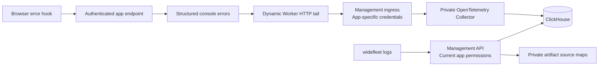

For opt-out product analytics and Widefleet crash reports sent to the Widefleet team, see [installation reporting](/self-hosting/installation-reporting). The runtime logs described here remain in the operator's infrastructure.

Widefleet uses ClickHouse as its telemetry store. The starter captures browser and server errors automatically; app authors and coding agents query the same authorized API through `widefleet logs`. The local `./dev` installation starts ClickHouse and the Collector automatically. Existing production installations enable the versioned configuration below deliberately. This feature requires matching CLI, management and agent builds containing the telemetry changes; earlier published images do not acquire it from configuration alone.



## Installation

Add `infra/compose.telemetry.yaml` to an explicit Compose selection. For example, an Azure installation can use:

```dotenv
COMPOSE_FILE=infra/compose.base.yaml:infra/compose.azure.yaml:infra/compose.acme-cloudflare.yaml:infra/compose.telemetry.yaml
CLICKHOUSE_READ_PASSWORD=REPLACE_WITH_RANDOM_HEX
CLICKHOUSE_INGEST_PASSWORD=REPLACE_WITH_DIFFERENT_RANDOM_HEX
```

The original `infra/compose.yaml` include wrapper remains usable without telemetry. To enable it with local PostgreSQL/RustFS, select `compose.base.yaml`, `compose.postgres.yaml`, `compose.s3.yaml`, `compose.rustfs.yaml` and `compose.telemetry.yaml` explicitly. Do not layer overrides over the include wrapper.

Prepare `${PLATFORM_DATA_DIRECTORY}/clickhouse` and `${PLATFORM_DATA_DIRECTORY}/otel-queue`. The Collector runs as container UID/GID 10001; that identity must own `otel-queue`. ClickHouse's entrypoint prepares ownership of its data directory. For rootless Docker, set ownership through a temporary container on the same daemon, as in the storage setup in [operations](/self-hosting/installation). Retain both directories across updates and include them in the installation's stopped, consistent backups.

Using the intended private environment file and matching image manifest, pull and start `clickhouse` and `otel-collector`, then recreate management and the agent. No telemetry port is published. Only management connects to the internal telemetry network; app runtimes send OTLP to the management origin over HTTPS. `infra/telemetry/schema.sql` initializes a new ClickHouse data directory. Existing directories need explicitly applied, versioned schema updates; startup initialization does not migrate an existing schema.

The next app deployment enables telemetry for that app by including its destination in the app snapshot. This does not recreate the shared container. Rotating `BETTER_AUTH_SECRET` rotates app ingestion credentials and requires redeploying existing apps. Disabling the deployment executor does not revoke telemetry for an already published app.

## Querying

```sh
widefleet logs --level error --since 1h --json
widefleet logs --source browser --json
widefleet logs --deployment DEPLOYMENT_UUID --json
widefleet logs --request-id REQUEST_ID --json
widefleet logs --trace-id TRACE_ID --json
widefleet logs --query "connection refused" --since 30m --json
widefleet logs --follow --json
```

The default is the latest 100 ingested records whose event timestamps fall within the last hour. `--limit` accepts 1–500, `--since` accepts a duration (`s`, `m`, `h`, `d`) or an ISO timestamp, and `--until` closes a historical range. Ranges are limited to 30 days. Severity is a minimum threshold. Sources are `browser`, `server`, and `runtime`. The current app-tail channel does not export native spans. Without an app UUID, the CLI performs a read-only lookup using `name` from the selected Wrangler config. Redirected output is JSON lines by default; diagnostics go to stderr.

Deployment filtering includes browser errors from that deployment's build. Browser records retain a null deployment ID because the same build can be deployed more than once; the current ingestion server's deployment must not be attributed to an older tab.

Relative lookbacks are measured from `--until` when supplied, otherwise from one current-time boundary. Absolute timestamps support timezone offsets and up to nine fractional digits (nanoseconds); filtering, range validation and pagination preserve that precision. Pagination preserves both event-time boundaries. Each new follow window advances its upper boundary and, when necessary, its lower boundary to keep the event-time range within 30 days.

`GET /api/v1/apps/{appId}/logs` requires `platform:read` and a current Developer, App admin or Owner role, or platform administrator access. It returns `entries`, `nextCursor`, `receivedThrough` (microseconds since epoch) and the resolved `since` timestamp. Filters match the CLI, with `deploymentId`, `requestId`, and `traceId` in the API. Cursors are signed and bound to the filters and app; every page rechecks current access. CLI users never receive ClickHouse credentials or arbitrary SQL access. OpenAPI describes the query contract.

Log queries return HTTP 503 with code `TELEMETRY_NOT_CONFIGURED` when runtime logging has not been enabled. The message asks an administrator to enable telemetry; retrying alone cannot resolve this state. A configured logging service that fails returns `TELEMETRY_UNAVAILABLE` with a message to try again later. App authorization is checked before either response. The CLI displays these messages and exits unsuccessfully, including in follow mode. Backend error details stay in management server logs; querying an installation without telemetry does not produce a crash report.

`--follow` first prints bounded history, then polls every second. It follows **ingestion time**, so a delayed export with an older event timestamp still appears. Each polling window uses keyset pagination and a 60-second overlap; record IDs suppress repeat output within that overlap. Arrival order can differ from event-time order, and the first overlap can backfill extra historical entries. The deduplication buffer is capped at 100,000 IDs; exceeding it stops with an explicit error so filters can be narrowed. Failed API calls stop with a nonzero status. This is near-live polling, not a lossless streaming subscription; a write taking longer than the overlap can be missed by a running follower and still be found in history. OTLP retries can produce duplicate stored events.

## Capture, correlation and source maps

A tail is a trusted handler receiving console records and exceptions after a Dynamic Worker HTTP request. The loader attaches an app-specific handler, which sends OTLP JSON to management using credentials unavailable to app code. Ingress verifies the credential and that the app still exists and is not deleting; the Collector overwrites the resource app ID from a trusted ingress header before queuing. An application's message cannot choose another app's partition.

celld 0.6.1 does not deliver these Dynamic Worker tails for RPC, Cron or Queue invocations. Their console logs/exceptions are absent from app log history. Native fleet OTLP export is disabled because it cannot safely be assigned to a single app in the shared fleet; native distributed traces are therefore absent too. Administrative fleet diagnostics remain a separate addition. Container logs remain available to the operator.

The starter reports unexpected SvelteKit errors, server HTTP 5xx outcomes, browser `error` and `unhandledrejection` events, and explicit `captureError` calls. Browser reporting requires existing app authentication, same-origin requests, bounded payloads, rate limits and duplicate suppression. Browser reports preserve the build ID of the running tab. The loader injects the server deployment ID. The trusted tail adds the executing snapshot’s build and deployment IDs to ordinary console records and unhandled exceptions; structured reports keep their own context. HTTP tails do not provide native trace/span IDs, so ordinary console records cannot inherit request IDs from the starter’s structured request records.

Source maps stay in private artifact storage and are never placed in the public asset manifest or runtime module directory. Matching build IDs select immutable source maps; stack frames include the generated location and, when available, the original file, function, line and column. Both displayed lines and columns are one-based. Missing or invalid maps leave the generated stack available. Resolution bounds map downloads per query to 32 MiB and inspects at most 64 stack lines per record. A missing version or map is not evidence that the generated location is an original source file.

SvelteKit handles exceptions internally, so the starter hooks capture framework-level errors independently of native span status. Deliberately caught failures require `captureError`; arbitrary silent application failures cannot be inferred by the platform. Existing apps must merge the starter hooks and enable Vite source maps before redeploying.

## Storage and failure behavior

The pinned Collector sends logs and traces to the versioned `otel_logs` and `otel_traces` tables. `runtime_logs` combines console records with failed spans. ClickHouse retains records for 30 days from ingestion; TTL deletion is asynchronous. Changing retention is a versioned schema change. Deleting an app removes API access and ingestion authorization immediately, while already stored telemetry expires according to this retention policy.

Management uses a read-only ClickHouse account; the Collector has insert/select access. Its persistent export queues hold up to 10,000 requests per signal and retry unavailable ClickHouse indefinitely while capacity remains. The app-tail sender has no durable queue or retry. Browser delivery is best-effort with no retry. Full queues, runtime crashes, management outages and client disconnection can therefore lose telemetry without blocking application requests. Monitor disk space, Collector export failures and tail delivery errors. Telemetry includes application-controlled messages and stacks; normal app data may occur in them.
