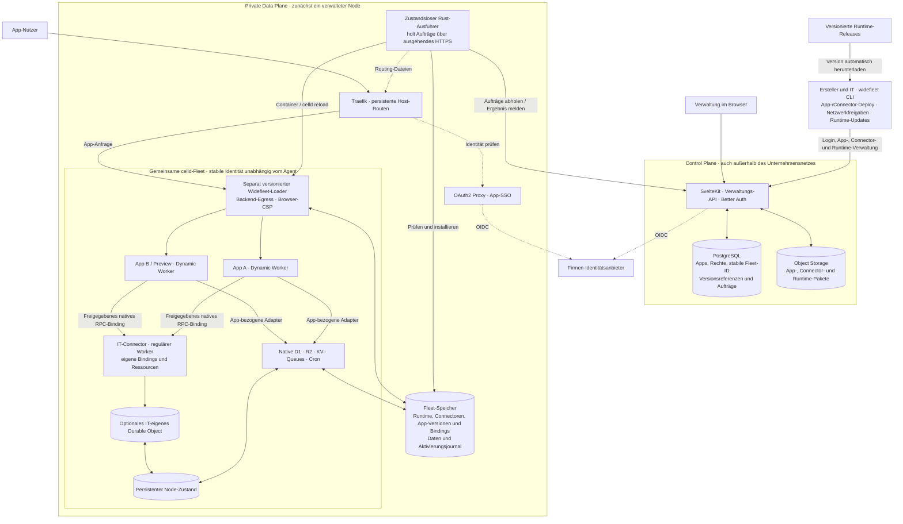

# Architektur

Die Plattform trennt lokalen Build, Verwaltung und laufende Apps. Die Referenzinstallation läuft auf einem Docker-Host; Einrichtung und Betrieb beschreibt der [Operations Guide](https://widefleet.com/docs/self-hosting/installation).

Die Referenz-Compose-Dateien können beide Ebenen auf einem Host betreiben. Der Ausführer benötigt keinen eingehenden Verwaltungszugang ins Unternehmensnetz. Seine Registrierung authentifiziert die Ausführung; sie definiert weder Fleet-Identität noch App-Datenpfade. Ein Ersatz-Agent verwendet dieselbe Fleet, denselben persistenten Node-Speicher und dieselben Routen. Mehrere gleichzeitig verwaltete Nodes und automatisches Load-Balancing sind noch nicht implementiert.

## Einrichtung

Infrastrukturwerte bleiben in Compose. Die erste Einrichtung erstellt einen lokalen Owner; die Einstellungen für Firmenanmeldung und optionale Gruppensuche liegen anschließend in PostgreSQL. UI und CLI verwenden dieselben Serverfunktionen. Nach einem geprüften Firmenlogin schließt der Owner den Passwortzugang. Ein optionales Bootstrap-Dokument automatisiert die Ersteinrichtung; spätere Starts importieren es nicht erneut.

Die Control Plane schreibt die App-SSO-Konfiguration in ein gemeinsames Volume. Der SSO-Container prüft sie, übernimmt sie und bewahrt den aktiven Stand für einen eigenständigen Neustart auf. Weder App-Anfragen noch SSO-Neustarts benötigen die Control Plane oder PostgreSQL.

## Verwaltungsoberfläche und API

Die SvelteKit-Oberfläche liest Daten über Remote Queries und ändert sie über Remote Forms beziehungsweise Commands. Die zugehörigen Module liegen in `apps/control-plane/src/lib/*.remote.ts`. Remote Functions und asynchrone Komponenten sind im SvelteKit-Plugin aktiviert. Die Seiten-Loader prüfen die Anmeldung und laden Queries vor, damit Weiterleitungen und HTTP-Fehler bereits beim Seitenaufruf korrekt zurückgegeben werden. Better Auth übernimmt weiterhin Login, Logout, Gerätefreigabe und Wiederherstellung.

Auch die Telemetrie-Einstellungen und die Berichtsvorschau nutzen Remote Functions. Die Erfassung von Browserfehlern verwendet ihre separaten HTTP-Endpunkte mit Timeout und `keepalive`.

CLI, Deployment-Agent und externe Integrationen verwenden die oRPC/OpenAPI-Endpunkte unter `/api/v1`. Beide Zugänge rufen die Geschäftslogik in `src/lib/server` direkt auf. Die Schnittstellen übernehmen Eingabevalidierung, Authentifizierung, Fehlerdarstellung und das Aktualisieren angezeigter Daten. Geschäftsregeln und ressourcenbezogene Berechtigungen bleiben in den gemeinsamen Serverfunktionen. Auch direkte Remote-Aufrufe prüfen die aktuelle Sitzung und Berechtigungen; ein geschützter Seiten-Loader ersetzt diese Prüfung nicht.

App- und Mitgliederformulare funktionieren auch ohne JavaScript. Mit JavaScript zeigen sie laufende Anfragen an und aktualisieren betroffene Queries. Rechteänderungen und angeforderte Deployment- oder Löschaufträge werden erst nach Serverbestätigung angezeigt; ein angenommener Auftrag ist noch keine abgeschlossene Ausführung. Optimistische Updates sind für geeignete reversible Änderungen vorgesehen, einschließlich Fehlerbehandlung und Abgleich mit dem Serverzustand.

## Deployment

1. `PLATFORM_URL` und `name` in `wrangler.jsonc` bestimmen die App. Beim ersten Deploy wird sie der Standard-Fleet zugeordnet. Die CLI baut und bündelt lokal; [Installation](https://widefleet.com/docs/getting-started/installation).
2. Die CLI lädt Assets, Worker und Metadaten hoch. Die Control Plane speichert Artefakte im Object Storage und einen dauerhaften Fleet-Auftrag in PostgreSQL.
3. Ein registrierter Ausführer holt den nächsten Auftrag. Leases, Heartbeats und Reihenfolge gelten für die ganze Fleet, damit gleichzeitige Veröffentlichungen deren gemeinsame Konfiguration nicht überschreiben.
4. Der Agent prüft App- und Runtime-Artefakte und installiert den vorbereiteten Stand. Der Loader lädt jede App mit eigenen Bindings als Dynamic Worker. App-Code und Runtime sind unabhängig versioniert; die JavaScript-Runtime ist nicht ins Rust-Binary eingebettet.
5. Bei neuen nativen Ressourcen oder Runtime-Änderungen wird celld neu geladen. Reine App-Codewechsel wählen einen neuen App-Snapshot. Bereits laufende Requests können ihren alten Stand zu Ende verwenden. Erst nach erfolgreicher Prüfung werden App-Zuordnung und Route aktiviert; ein persistentes Journal sichert Wiederherstellung nach Abbruch.

[Runtime-Updates und Rollbacks](https://widefleet.com/docs/reference/runtime) benötigen innerhalb des unterstützten Paketformats keinen Agent-Release. Installierter Code, Routing und Daten sind lokal beziehungsweise im Fleet-Speicher verfügbar; App-Anfragen und Neustarts benötigen weder Control Plane noch Deployment-Agent.

## Netzwerkkontrolle

Backend- und Browser-Freigaben bestehen aus getrennten Listen exakter HTTPS-Origins. Der vertrauenswürdige Loader prüft Backend-Aufrufe außerhalb des App-Codes und setzt CSP auf App-Antworten und Assets. Netzwerkänderungen erzeugen neue App-Snapshots; Code-Rollbacks behalten den aktuellen Regelstand. Die CLI verwendet Projektkontext oder App-Namen und einen normalen Login mit kombinierbaren Scopes. Bedienung und Grenzen beschreibt [Netzwerkkontrolle](https://widefleet.com/docs/guides/network).

IT-Projekte veröffentlichen eigene reguläre Worker mit `widefleet connector deploy`. Die CLI bündelt den Code, übergibt das Artefakt an die Verwaltung und wartet auf die Aktivierung in derselben Fleet. Freigegebene Apps rufen direkte RPC-Methoden auf; eigene DOs bleiben Teil des IT-Projekts. Connector-Updates benötigen weder einen neuen Runtime- noch Agent-Release. Details und aktuelle Grenzen beschreibt [IT connectors](https://widefleet.com/docs/guides/connectors).

## Authentifizierung

| Zugang                | Umsetzung                                                                              |
| --------------------- | -------------------------------------------------------------------------------------- |
| Verwaltungsoberfläche | Better Auth mit konfiguriertem OIDC-Anbieter                                           |
| CLI                   | Better Auth OAuth Device Flow; kurzlebige Access-Tokens und erneuerbare Refresh-Tokens |
| Ausgeführte Apps      | Traefik prüft über OAuth2 Proxy die konfigurierte Firmenanmeldung                      |
| Deployment-Agent      | Eigenes, getrenntes Agent-Token                                                        |

Beim App-Aufruf entfernt Traefik mitgeschickte Identitätsheader und setzt die geprüfte Identität. Der SvelteKit-Starter stellt sie als `locals.user` bereit. App-Code erhält keine Login-Tokens oder SSO-Cookies; eigene serverseitige App-Cookies sind im MVP ebenfalls deaktiviert.

Die Control Plane verwaltet Rollen für Personen und SSO-Gruppen pro App. Alle Previews erben Eigentümerschaft, Rollen und Zugang automatisch. UI, API und `widefleet roles` verwenden dieselben Berechtigungsprüfungen. Der Agent installiert daraus abgeleitete Zugangsregeln über persistente Traefik-Konfiguration. Ein lokaler Authorizer prüft sie anhand der von OAuth2 Proxy bestätigten Identität; neue Regeln werden erst nach einem Proxy-Probeaufruf als aktiv gemeldet. App-Aufrufe benötigen weiterhin weder Control Plane noch PostgreSQL. Verhalten bei Regeländerungen, Grenzen und Installation beschreibt [App access](https://widefleet.com/docs/reference/app-access).

## Mitgliedschaften und App-Rechte

Better Auth verwaltet eine feste Organisation pro Installation mit den Rollen **Owner**, **Admin** und **Member**. Jedes Mitglied darf Apps erstellen. Owner und Admins verwalten zusätzlich alle Apps, Mitglieder und Deployment-Agenten; nur Owner dürfen Owner ernennen oder ändern. Die Verwaltungsoberfläche bietet dafür eine Mitgliedersuche und Rollenwahl. Die API liest die aktuelle Mitgliedschaft bei jedem Browser- und CLI-Aufruf aus PostgreSQL.

Neue Mitglieder entstehen bei der ersten geprüften Anmeldung an der Verwaltung. Wer nur eine veröffentlichte App über deren separates App-SSO benutzt, erhält dadurch keine Verwaltungsmitgliedschaft. Der Identitätsanbieter steuert die Zulassung zu diesen beiden Anmeldungen getrennt.

App-Eigentümerschaft und Rollen bleiben Widefleet-Daten. Sie referenzieren Personen oder Gruppen über stabile IDs des Identitätsanbieters. Ein Member verwaltet Apps entsprechend seiner appbezogenen Rollen; Gruppenmitgliedschaften stammen aus dem Firmen-SSO. Rollen und Übergabe stehen auf der App-Seite, in der API und über `widefleet roles` bereit. Details zu den Rollen und zur Rechteverwaltung stehen im [Operations Guide](https://widefleet.com/docs/self-hosting/installation#management-members-and-app-collaboration).

## Daten und Laufzeit

Die Referenzinstallation im Diagramm verwendet RustFS. Der Code unterstützt zusätzlich Azure Blob Storage und Google Cloud Storage für Artefakte und Fleets. Der Agent verwendet dafür cellds native `az://`- beziehungsweise `gs://`-Anbindung; Cloud-Infrastruktur und Datenmigrationen werden dabei nicht angelegt. Konfiguration und Testgrenzen beschreibt [Storage Backends](https://widefleet.com/docs/self-hosting/storage). Die gepflegten [Compose-Konfigurationen](https://widefleet.com/docs/self-hosting/external-services) verbinden dieselben Dienste mit externem PostgreSQL und dem gewählten Speicher. Traefik verwendet wahlweise bereitgestellte Zertifikate oder Let’s Encrypt mit Cloudflare-DNS-Prüfung und persistentem Zertifikatsspeicher.

- PostgreSQL enthält die Verwaltungsdaten und Deployment-Jobs.
- Der Artefakt-Bucket hält hochgeladene Versionen für Deployments und Rollbacks.
- Der Loader vermittelt die deklarierten D1-, R2-, KV-, Queue- und Asset-Bindings. Cron- und Queue-Ereignisse werden an den veröffentlichten App-Stand zugestellt. Ressourcen werden nur bei entsprechender Deklaration eingerichtet.
- Jede Preview bekommt einen eigenen Dynamic Worker und eigene Ressourcen innerhalb derselben Fleet. Ein Code-Rollback erhält die aktuellen Datenbank- und Dateiinhalte.

Laufende Apps können auch bei ausgefallener Control Plane weiterlaufen; Proxy, App-SSO und Speicher bleiben dafür erforderlich. Die Referenzinstallation teilt sich einen Speicherprozess und verwendet installationsweite Speicherzugangsdaten für celld. Sie ist für vertrauenswürdige interne App-Ersteller ausgelegt.

`nodejs_compat` erschließt cellds vorhandene Node-APIs; deren Unterstützung bleibt teilweise. Details stehen im [Starter-Vertrag](../starters/sveltekit/README.md#nodejs-compatibility). Aktivierung, Wiederherstellung und verbleibende Grenzen sind im [Runtime-Vertrag](https://widefleet.com/docs/reference/runtime) beschrieben.
