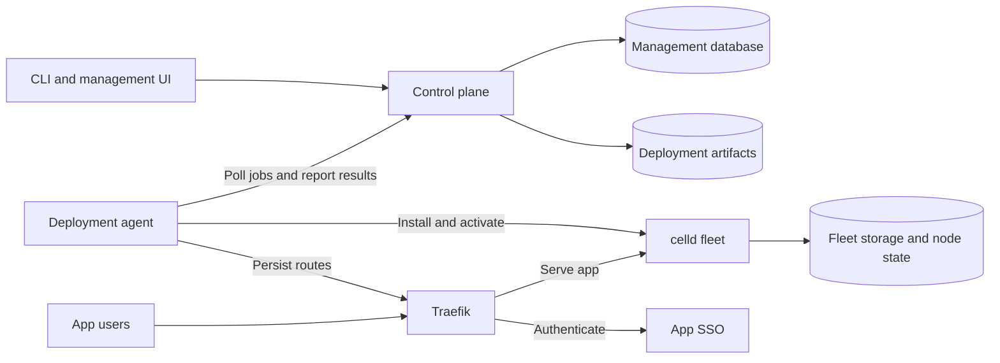

# Architecture

These boundaries matter when changing Widefleet across components. For installation and operation, use the [self-hosting guide](https://widefleet.com/docs/self-hosting/installation); for local verification, use [development and checks](development.md).

## Serving apps independently of management

The control plane owns desired configuration and deployment jobs; serving apps use installed state. The agent polls over outgoing HTTPS, so management does not require inbound access to the company network. App requests and runtime restarts must work without the control plane, PostgreSQL or the agent. Proxy, app SSO, runtime and storage remain required.

The fleet's identity and data outlive an agent registration. Replacing an agent must reuse the fleet, persistent node state and routes rather than derive new storage paths from the agent ID. See [fleet assignment](../apps/control-plane/src/lib/server/fleets.ts) and [fleet storage](../crates/platform-agent/src/fleet.rs).

App SSO also preserves validated configuration for restart without management. Changes to identity setup must retain this separation; the [SSO restart tests](../apps/control-plane/tests/installation/sso-supervisor.test.ts) exercise it.

The reference installation uses one managed node and shared storage credentials. It assumes trusted internal app creators; app-scoped bindings do not make it an infrastructure isolation boundary for hostile tenants. Multiple managed nodes and automatic load balancing are not implemented.

## Shared authorization, separate identities

The UI's remote functions and the CLI's HTTP API call shared server operations directly. Resource authorization belongs in those operations so both interfaces apply the same policy. A protected page loader is not sufficient: remote functions are independently callable and must authenticate each request. See [remote request authentication](../apps/control-plane/src/lib/server/remote-support.ts) and [API wiring](../apps/control-plane/src/lib/server/api.ts).

Management membership and app usage are separate. Signing into a published app must not enroll a management member; management access must not implicitly grant app usage. App access rules also apply to previews through their parent. Keep these boundaries when changing [membership](../apps/control-plane/src/lib/server/organization.ts) or [app access](../apps/control-plane/src/lib/server/app-access.ts); the public [app access reference](https://widefleet.com/docs/reference/app-access) owns the user-facing rules.

Traefik removes client-supplied identity headers and forwards only the identity established by app SSO. App code must not receive login tokens or SSO cookies. The [edge tests](../apps/control-plane/tests/edge/sso.test.ts) verify this boundary across proxy and runtime changes.

## Activation is a fleet-wide operation

Apps share celld configuration, so jobs are serialized per fleet, not per app or agent. Leases fence stale acknowledgments and retries retain their ordering. Changing [job scheduling](../apps/control-plane/src/lib/server/jobs.ts) requires preserving this constraint even when two jobs target different apps.

An accepted job records intent, not successful activation. The agent prepares and checks candidate snapshots before switching serving state. Runtime and connector changes can affect every published app, including one whose activation has not yet been acknowledged to management. Keep the previous usable state available until those checks pass.

Activation spans object storage, the running node and routing files; it is not a database transaction. The [fleet activation journal](../crates/platform-agent/src/fleet.rs) must remain recoverable through agent or runtime interruption. [App access activation](../crates/platform-agent/src/access.rs) additionally probes the proxy before confirming that a rule revision is active. The [deployment suite](../apps/control-plane/tests/runtime/deployment.test.ts) exercises failure and restart recovery.

## Code versions do not own current policy or data

App snapshots are immutable so in-flight requests can finish against the version they started with. A code rollback does not restore database or file contents, or undo current network and connector permissions. Keep those policies separate from the uploaded code when changing deployment selection.

Previews have independent app resources within the same fleet. Long-running Workflows can retain older code and its resource bindings after a newer app version is published; retaining those bindings must not revive old event subscriptions. See [snapshot preparation](../crates/platform-agent/src/fleet.rs) and the [Workflow adapter tests](../apps/control-plane/tests/runtime/workflow-adapter.test.ts).

Backend network enforcement lives in the trusted loader outside app code, while browser restrictions depend on response CSP. Neither replaces the other. See [backend egress](../packages/app-runtime/src/egress.ts), [browser policy](../packages/app-runtime/src/csp.ts) and the public [network guide](https://widefleet.com/docs/guides/network).

The JavaScript runtime is versioned separately from the agent, but its package protocol and celld version must match the agent's supported contract. Independent runtime publication is not permission to change that contract without an agent release. Before upgrading celld, review the [native runtime pitfalls](runtime-implementation.md).
